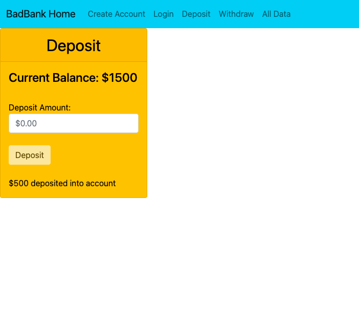

# bad-bank

# 

## Table of contents
* [General info](#general-info)
* [Skills](#skills)
* [Setup](#setup)
* [Roadmap of Future Improvements](#Roadmapoffutureimprovements)

## General info
This is a single page web application built using React. This application is "bad" bank since this is just the front end without back-end security to properly handle bank account information. There are various layers of validation to ensure a user cannot over draw their account or deposit/withdraw a negative number. All buttons are disabled at the load of each page. 
	
## Skills
This exercise uses:
* JavaScript
* Building, testing and deploying a React application
* Design and build UI components using React
* Bootstrap

	
## Setup
To run this exercise, simply clone this respository. In your terminal you will want make sure repo is your current directory and then open a local server. 
$ http-server -c-1 and click on the folder.

## Roadmap for Future Improvements
* Update UI 
* Create back-end for a complete application
